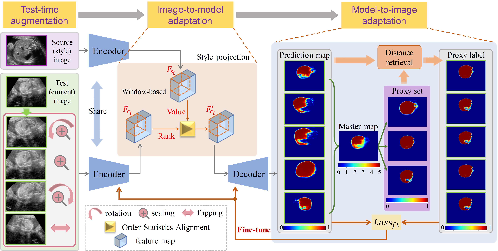

# Test-time Bi-directional Adaptation between Image and Model for Robust Segmentation

In this paper, we aim to develop a general way to generalize existing segmentation models to samples with unknown appearance shift when deployed in daily clinical practice. We propose an effective test-time bi-directional adaptation solution for this aim by combining two complementary strategies. 



### Prerequisites
- Python 3.8
- Check the requirements.txt

```bash
pip install -r requirements.txt
```

### Modify data path to your own in `config.py`
```python
cfg = Config({
    "train_dir": "",  ## Path to image folder
    "label_dir": "",  ## Path to label folder
})
```

### Train
```bash
CUDA_VISIBLE_DEVICES=<gpu_id> python code/train.py.py --dataset "your dateset name"
```

### Test (style transfer)
Arguments `adain`, `osa`, `wosa` for different style transfer modules
```bash
python code/seg_test.py --wosa
python code/seg_test.py --osa
python code/seg_test.py --adain
```

### Test (Augmented self-supervision)
```bash
python code/seg_augself.py  ## AugSelf
python code/seg_augself.py --wosa  ## WOSA-AugSelf
```

